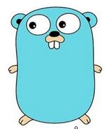
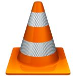

### Hi 👋, I'm Alpha-1729

<!-- My profile pic -->

<!-- Languages -->

## Languages Used

<!-- Software -->

## :point_right:Favourite Software

<!--  Os Used-->

## :point_right:Favourite OS

<!--My Github Stats-->

## My GitHub Stats :point_down:

<!-- Top Languages Used -->
<!-- Themes supported ->dark, radical, merko, gruvbox, tokyonight, onedark, cobalt, synthwave, highcontrast, dracula. -->

## Top Languages Used :point_down:

